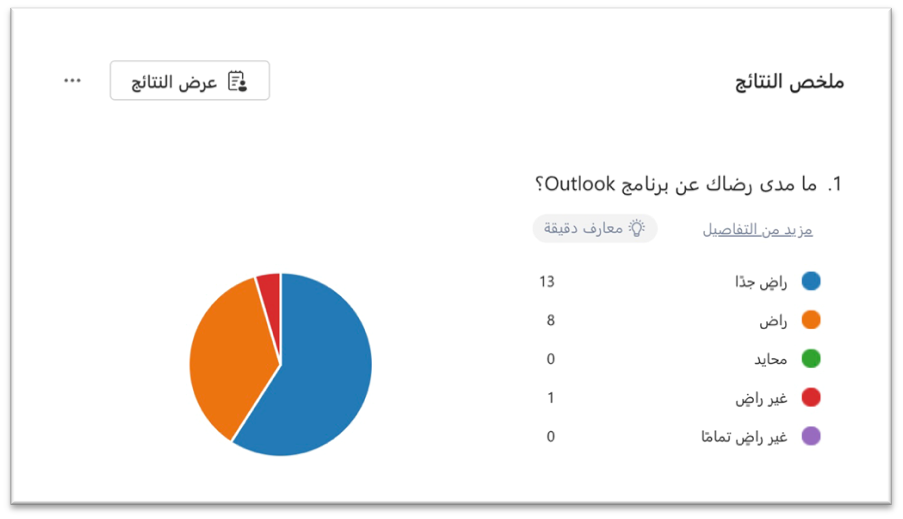
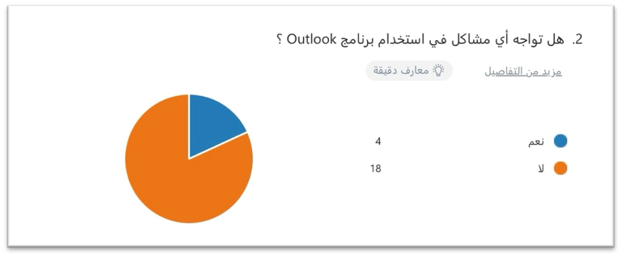
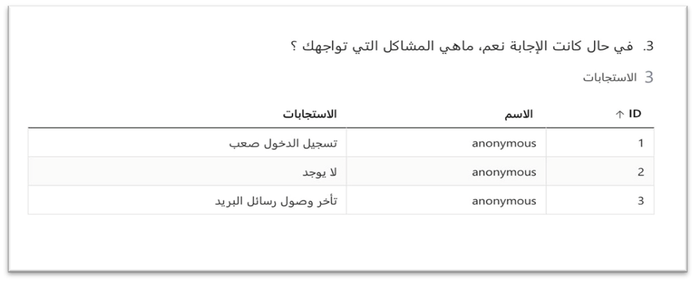
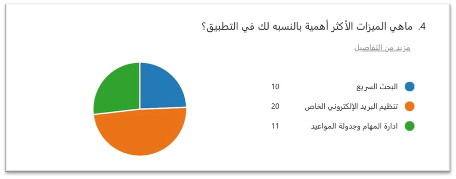
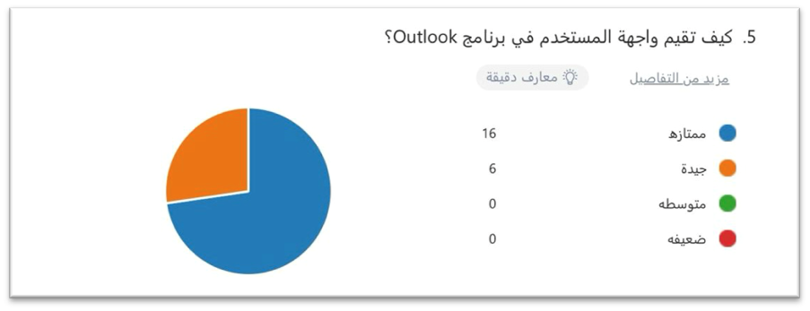
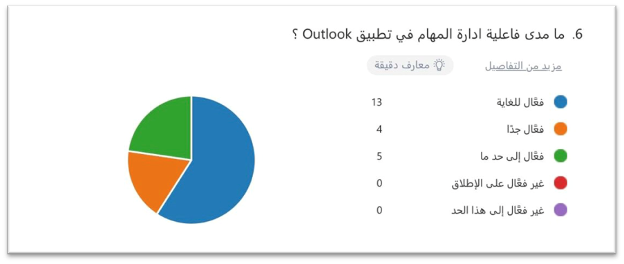
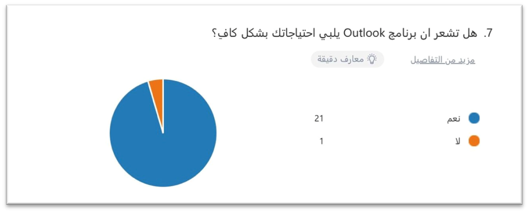
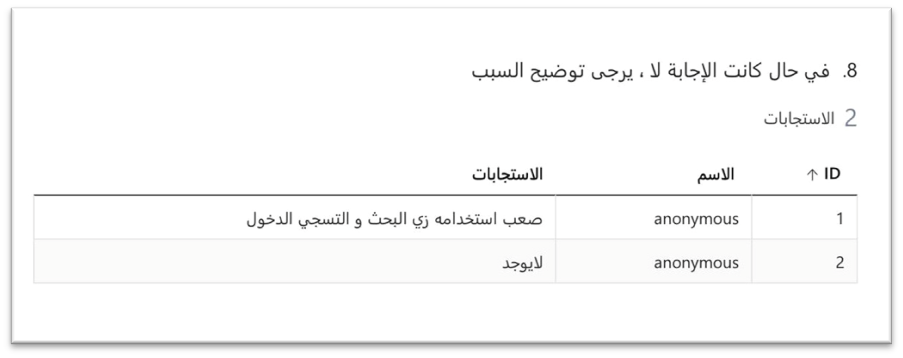
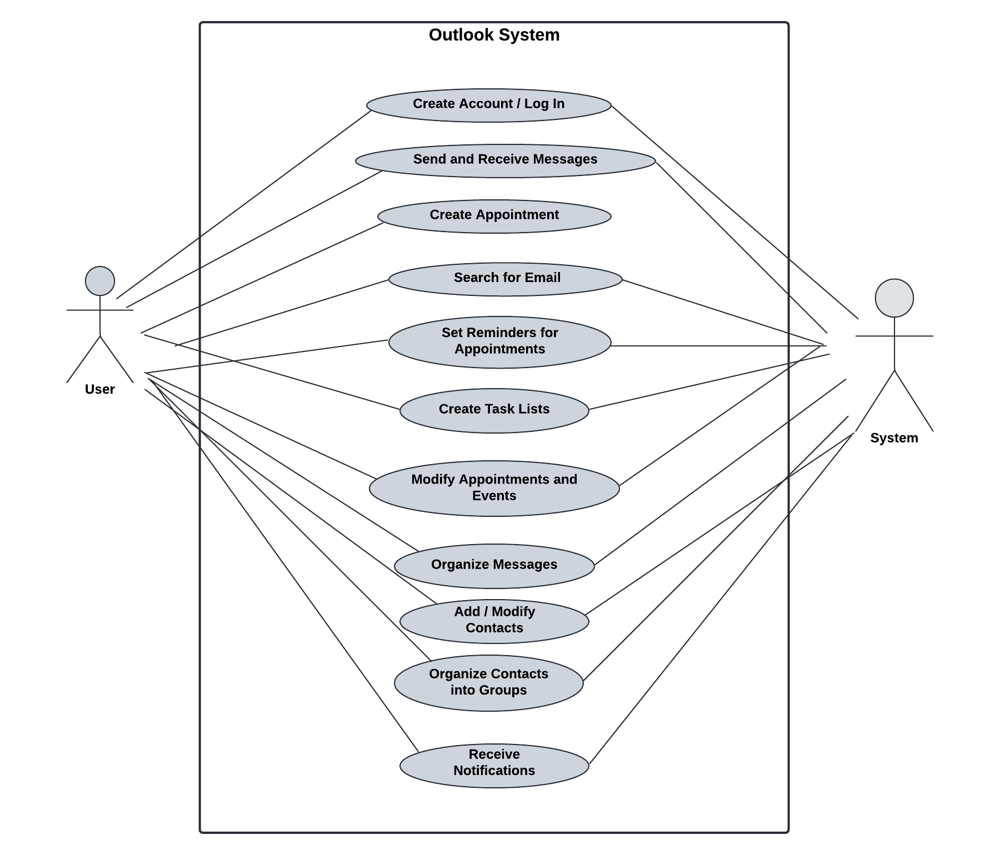

# 1. Introduction

Outlook organizes your emails and calendars to see your contacts, tasks, and to-do lists, all in one place. This organization starts with your email account. From there, you can start working with your emails, turning them into tasks, or tracking and recording information about the people who interact with them.

# 2. Program's Purpose

The purpose of the Outlook application is to help users manage their emails, organize appointments and tasks, and communicate with others. Users face difficulty in organizing their private mail, ease and speed of communication, and also a problem in organizing their appointments and tasks, and Outlook solves these problems:

- **Organizing appointments**: It helps in scheduling meetings and appointments in an organized manner and sends reminder notifications to the user.
- **Easy communication**: It makes it easy to communicate with customers and employees as a message can be sent to a large group of people at once.
- **Email management**: It helps solve the problem of inbox congestion by placing unimportant messages in the unimportant messages section. Messages can also be archived, and messages that are of interest to the user can be marked.

# 3. Requirements

## 3.1 Functional Requirements

1. **Sending and Receiving Messages**: Users can send or receive messages through their personal email.  
2. **Email Search**: Users can search for anyone’s email if they have the software.
3. **Creating Appointments**: Users can create an appointment or meeting and specify the invited attendees.
4. **Modifying Appointments and Events**: Users can modify their appointment and events as needed.
5. **Setting Reminders for Appointments**: Users can set reminders to alert them about upcoming appointments and events.
6. **Creating Task Lists**: Users can create task lists to organize the work that needs to be completed.
7. **Adding and Modifying Contacts**: Users can add new contacts and modify the information of existing contacts.
8. **Organizing Contacts into Groups**: Users can organize contacts into groups for easier access.

## 3.2 Non-functional Requirements

1. **Performance**: Outlook should be able to handle a large number of emails and attachments without slowing down.
2. **Security**: Outlook should provide data encryption to ensure privacy.
3. **Reliability**: Outlook should be reliable and work properly at all times.
4. **Portability**: It should be easy to transfer data between different devices without losing any information.

## 4. Main Tasks

1. **Creating an Account or Logging In**: Users can create an account or log in to be able to receive and send messages.
2. **Notifications and Alerts**: The user receives a notification or alert when a message arrives or as a reminder for an appointment.
3. **Search**: Use the search bar to quickly find emails, contacts, or events.
4. **Facilitating Communication**: Provides an easy and effective way to send and receive messages.
5. **Organizing Messages**: Allows you to organize your inbox using folders and categories.
6. **Appointment Scheduling**: Helps in scheduling appointments and meetings for time management.
7. **Effective Communication**: Facilitates communication between colleagues and different departments within institutions.

## 5. Compare with Similar Software

### Google Workspace (Gmail):

#### Advantages:
- **Outlook**: Advanced features in organizing meetings and managing tasks.
- **Gmail**: Simple interface and integration with other applications.

#### Disadvantages:
- **Outlook**: May be complex for new users.
- **Gmail**: Lacks some advanced task management features.

### Comparison:
- **Outlook**: Powerful in appointment management and integration with other Microsoft systems.
- **Gmail**: Focuses on simplicity and integration with Google services.
  
## 6. Survey

The team conducted several surveys to evaluate users’ experiences with Outlook. Below are the results:

### User Satisfaction Survey
A survey was conducted to evaluate users’ satisfaction with Outlook. Here are the results:

- **High satisfaction**: 84.4% of participants consider themselves "very satisfied," indicating excellent performance of the application.
- **Satisfaction rate**: 9.0% of users are satisfied, indicating that most have a positive experience.
- **Dissatisfied**: Only 0.4% were dissatisfied, and 0% were "very dissatisfied," showing few negative experiences overall. The results indicate that the Outlook application enjoys high satisfaction from its users.
  
   

### Survey on Problems Faced
A survey was conducted to assess whether users face any problems while using Outlook. Here are the results:

- **Yes**: 4 votes (18.2%)
- **No**: 18 votes (81.8%)

Most users do not encounter problems; however, 18.2% reported issues, specifically delays in loading messages, which affected their experience.

### Most Important Features Survey
A survey was conducted to determine the most important features users look for in Outlook. Here are the results:

- **Email organization**: 20% - highlights the importance of an effective system for organizing messages.
- **Task management and scheduling**: 11% - users want to use the app as a tool for managing their time and tasks.
- **Quick search**: 10% - reflects the importance of being able to search effectively within the app.

### User Interface Survey
A survey was conducted to evaluate the user interface in Outlook. Here are the results:

- **Excellent rating**: 16% of participants rated the interface as "Excellent," showing high satisfaction with the application's design.
- **Good rating**: 6% of users found the interface "Good," suggesting some positive feedback but room for improvement.
- **No average or poor ratings**: No participants rated the interface as "average" or "poor," indicating no significant negative impressions.

### Task Management Survey
A survey was conducted to evaluate the effectiveness of task management in Outlook. Here are the results:

- **Very effective**: 13% of users rated task management as “very effective.”
- **Somewhat effective**: 5% rated it as "somewhat effective," showing some positive feedback with room for improvement.
- **No negative ratings**: No users rated task management as ineffective.

### Meeting Users' Needs Survey
A survey was conducted to assess whether Outlook adequately meets the needs of users. The results:

- **Yes**: 95.5% of respondents feel that Outlook adequately meets their needs, indicating high satisfaction with the services provided by the program.
- **No**: A few users reported difficulty using basic functions, such as search and logging in. This feedback should be addressed to improve the user experience.

### Recommendations Based on Survey Results:
1. **Providing Educational Resources**: Create educational videos or step-by-step guides to explain how to log in and use the search feature effectively.
2. **Monitoring System Performance**: Regularly monitor the system’s message delivery performance to ensure there are no delays, and take immediate action if problems arise.

---
## 7. Data Models

### 7.1 Use Case Diagram

The Use Case Diagram represents the Outlook System. It outlines interactions between two actors: the User and the System, with several use cases detailing functionalities provided by the system. Here's a breakdown of the elements in the diagram:

- **User**: Interacts with the system to manage emails, appointments, tasks, and contacts.
- **System**: Facilitates the user's actions and provides notifications, reminders, and search functionality.

---
### 7.2 Database Description

The database of Outlook will be organized into eight entity "tables". This structure supports the main system functionalities and ensures efficient interaction between users, emails, appointments, tasks, and contacts.

#### Database Entities:
1. **Users**
    - Stores user data (account info, login details).
2. **Emails**
    - Stores emails (sender, recipient, subject, body).
3. **Appointments**
    - Manages scheduled appointments (title, time, reminder).
4. **Tasks**
    - Handles tasks (task details, due dates, priority).
5. **Contacts**
    - Stores user contacts (name, email, phone, group).
6. **Contact Groups**
    - Organizes contacts into groups.
7. **Notifications**
    - Stores reminders and alerts.
8. **Search Logs**
    - Logs user searches (query, timestamp).

#### Communication/Relationships:
1. **Users ↔ Emails**: One-to-many (A user sends/receives multiple emails).
2. **Users ↔ Appointments**: One-to-many (A user creates many appointments).
3. **Users ↔ Tasks**: One-to-many (A user manages multiple tasks).
4. **Users ↔ Contacts**: One-to-many (A user manages multiple contacts).
5. **Contacts ↔ Groups**: Many-to-many (Contacts belong to multiple groups).
6. **Users ↔ Notifications**: One-to-many (A user receives multiple notifications).
7. **Users ↔ Search Logs**: One-to-many (A user has many search logs).
